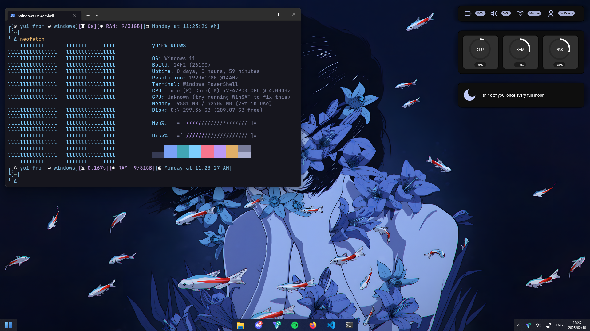
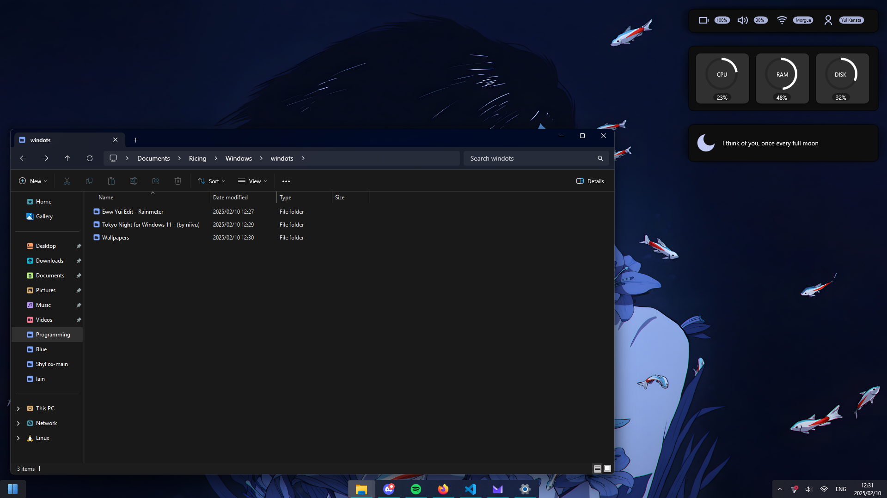
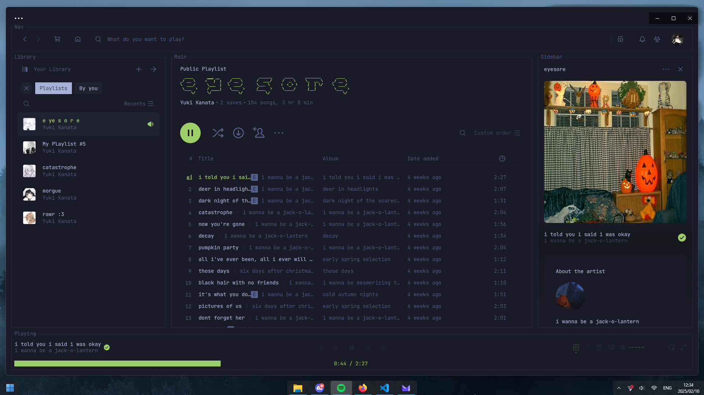
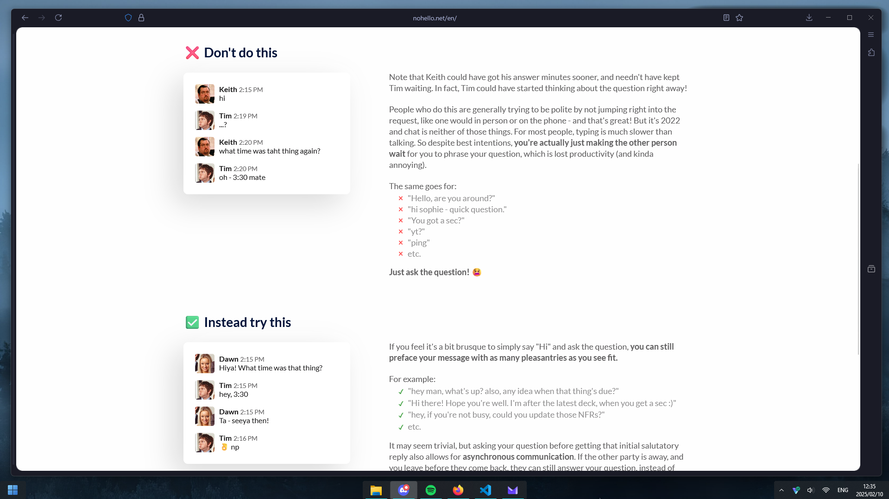

    <h1>🎇 Dotfiles 🎇</h1>

:3

- **File Manager** • [Tokyo Night](https://www.deviantart.com/niivu/art/Tokyo-Night-for-Windows-11-970381220)
- **Taskbar** • [Start All Back](https://www.startallback.com/)
- **Firefox** • [ShyFox](https://github.com/Naezr/ShyFox)
- **Backdrop** • [MicaForEveryone](https://github.com/MicaForEveryone/MicaForEveryone/releases)
- **Widgets** • [Rainmeter](https://www.rainmeter.net/)
- **Discord** • [system24](https://github.com/refact0r/system24)
- **Spotify** • [text](https://github.com/spicetify/spicetify-themes/tree/master/text)

    

    <h2>• Screenshots •</h2>
    
    
    
    
    

 
 

